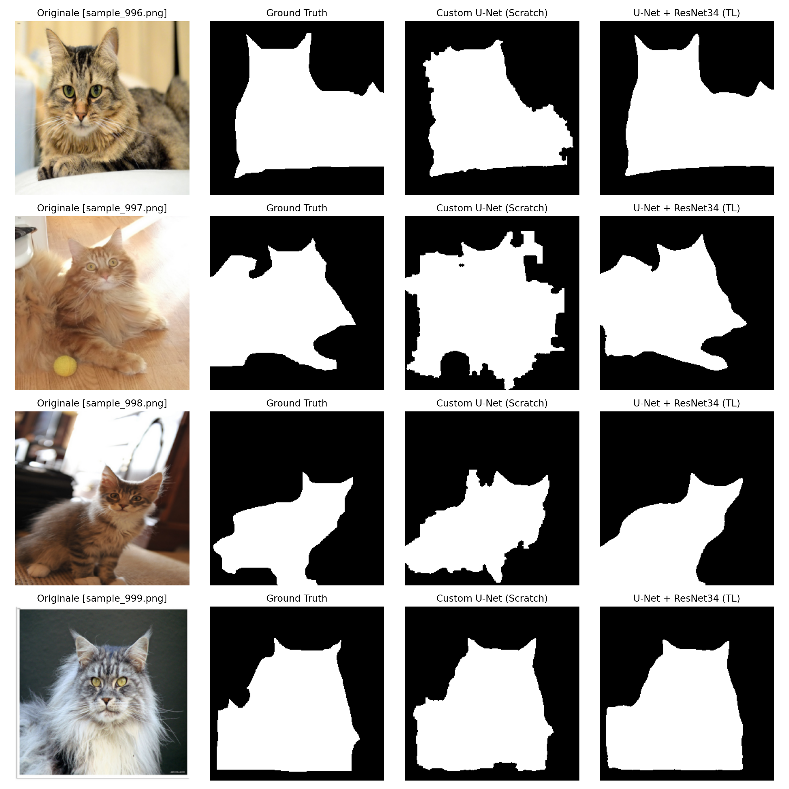

# Semantic Segmentation Benchmark: Custom U-Net (From Scratch) vs. Transfer Learning

Questo repository presenta uno studio comparativo e ingegneristico sulla **segmentazione semantica binaria** (animale target vs. sfondo) applicata a un dataset di animali, prevalentemente felini (~2000 immagini con split 80/20 train-validation). 

L'obiettivo è analizzare empiricamente il divario prestazionale, la velocità di convergenza e la capacità di disambiguazione semantica tra una rete implementata e addestrata da zero e un approccio industriale basato su Transfer Learning.

---

## 📊 Benchmark Visivo

Il confronto sulle predizioni del set di validazione mette a confronto l'immagine originale, la Ground Truth, la U-Net custom (from scratch) e la U-Net con backbone ResNet34 pre-addestrata (entrambe con soglia standard $\text{probs} > 0.5$):



---

## 📈 Risultati Quantitativi & Confronto

| Metrica / Parametro | Custom U-Net (From Scratch) | U-Net + ResNet34 (Transfer Learning) |
| :--- | :--- | :--- |
| **Inizializzazione pesi** | Random (Kaiming / He) | ImageNet Pre-trained |
| **Parametri Addestrabili** | ~7.8M | ~24.4M |
| **Epoche per convergenza** | ~50 epoche | < 5 epoche (30 totali) |
| **Best Val Dice Score** | ~0.805 | **> 0.900** |
| **Robustezza su texture complesse** | Vulnerabile a falsi positivi locali | Disambiguazione semantica completa |

---

## 🔬 Metodologia & Architetture

### 1. Custom U-Net (Scratch Baseline)
* **Architettura a blocchi**: Realizzata a basso livello in PyTorch (`model.py`), composta da blocchi simmetrici `DoubleConv` (Convoluzione 3x3, Batch Normalization, ReLU), pooling (`MaxPool2d`) e transposed convolution (`ConvTranspose2d`) con skip connections concatenate.
* **Loss Composita Personalizzata**: Per ottimizzare sia la classificazione puntuale dei pixel sia l'overlap complessivo della regione, è stata adottata una loss pesata: **0.6 · BCE + 0.4 · Soft Dice Loss**.
* **Pipeline di Post-Processing Morfologico**:
  * Estrazione della componente connessa a massima area per eliminare cluster di rumore isolati sullo sfondo.
  * Algoritmo di **Flood-Fill** bidirezionale per richiudere fori e lacune interne alla maschera.
  * Chiusura morfologica con kernel ellittico per regolarizzare i margini.

### 2. Transfer Learning (ResNet34 Backbone)
* **Encoder**: Backbone `ResNet34` pre-allenata su ImageNet integrata in un decoder U-Net.
* **Vantaggio**: Sfruttamento di gerarchie di feature visuali già consolidate (bordi complessi, forme anatomiche e silhouette), riducendo drasticamente il tempo di convergenza ed evitando l'overfitting locale tipico dei dataset di dimensioni contenute.

---

## 🧩 Analisi dell'Errore: Il Caso del Sample 997

Il punto cruciale del confronto emerge chiaramente nel **Sample 997**:
* **Limite del modello scratch**: Con circa 1.600 campioni in train, la rete addestrata da zero si affida principalmente a caratteristiche a basso livello (colore, grana, pattern locali). La texture del parquet chiaro e le sue venature vengono confuse ad alta confidenza con la pelliccia del gatto, provocando un consistente falso positivo.
* **Risoluzione tramite Transfer Learning**: La ResNet34 opera con un campo recettivo e un'astrazione contestuale di ordine superiore. Riconoscendo la struttura semantica complessiva (anatomia dell'animale vs. piano d'appoggio orizzontale), azzera i falsi positivi sul pavimento anche a soglia standard ($\text{probs} > 0.5$).

---

## 📁 Struttura della Repository

```text
├── outputs/
│   └── confronto_benchmark.png # Grafico a 4 colonne del benchmark visivo
├── dataset.py                  # Pipeline PyTorch Dataset e data augmentation
├── download_data.py            # Download e preparazione delle immagini
├── metrics.py                  # BCE + Dice Loss combinata e calcolo del Dice Score
├── model.py                    # Implementazione Custom U-Net from scratch
├── train.py                    # Training loop della baseline custom
├── train_tl.py                 # Fine-tuning della U-Net con ResNet34 pre-addestrata
├── predict.py                  # Inferenza e generazione della griglia comparativa
├── requirements.txt            # Dipendenze dell'ambiente
└── README.md                   # Documentazione del progetto

---

## 🚀 SETUP & UTILIZZO

```bash
# 1. Clona la repository
git clone [https://github.com/lorenzomarras1998/semantic-segmentation-unet-benchmark.git](https://github.com/lorenzomarras1998/semantic-segmentation-unet-benchmark.git)
cd semantic-segmentation-unet-benchmark

# 2. Installa le dipendenze
pip install -r requirements.txt

# 3. Scarica e prepara il dataset
python download_data.py

# 4. Addestramento dei modelli
python train.py       # Custom U-Net (scratch)
python train_tl.py    # U-Net + ResNet34 (Transfer Learning)

# 5. Genera il confronto visivo
python predict.py

💻 Note Hardware & Accelerazione
Il training e il benchmark sono stati condotti su GPU AMD Radeon RX 9070 XT con accelerazione DirectML.

La pipeline include un fallback automatico CUDA/CPU per garantire la piena riproducibilità su diverse architetture hardware.